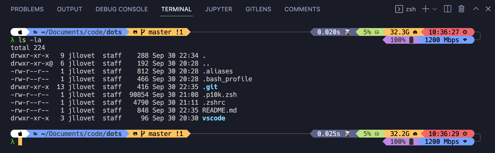

# Dotfiles for Quick Terminal Configuration

These dotfiles contain templates that can be used for bash and zsh configurations. They are sanitized, but based on my own, with quick aliases and some display customizations.

## Resources

- [How to Trick Out Your Terminal](https://hackernoon.com/how-to-trick-out-terminal-287c0e93fce0)
- [ohmyzsh/ohmyzsh](https://github.com/ohmyzsh/ohmyzsh)
- [romkatv/powerlevel10k](https://github.com/romkatv/powerlevel10k)
- [ryanoasis/nerd-fonts](https://github.com/ryanoasis/nerd-fonts)
- [MartinSeeler/iterm2-material-design](https://github.com/MartinSeeler/iterm2-material-design)
- [https://www.iterm2material.design/](https://www.iterm2material.design/)
- [hacckss-config](https://github.com/Powerlevel9k/powerlevel9k/wiki/Show-Off-Your-Config?ref=hackernoon.com#hacckss-config)
